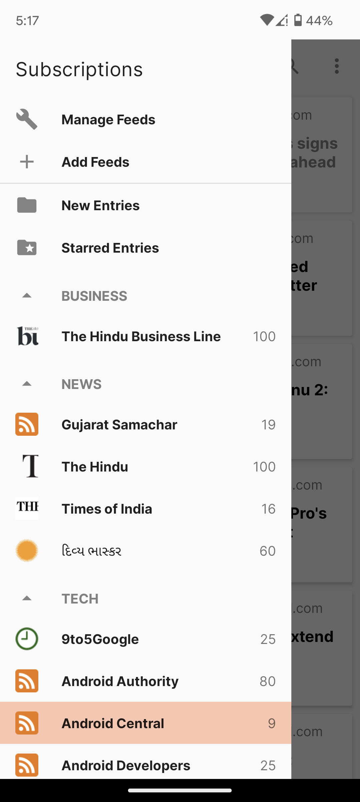
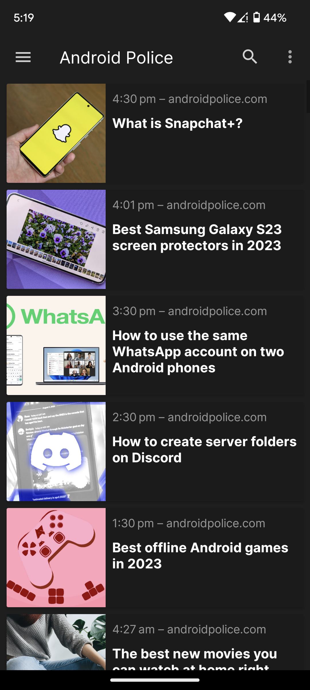
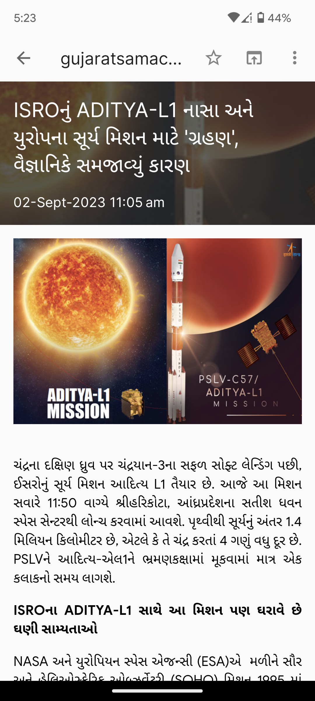

# FeedYOU

Feed You is Android RSS reader created in Material style. • Read news & articles from your favourite news channels & websites • Every single newspaper in single app without any ADS. • Organize & Customize feeds and articles as your liking and get control in your hands. • Filter articles by keywords, topics, or authors. • Share articles with others via email, social media, or other channels. • Get notification when new article comes from your subscribed feeds. • Feed You can save you from limitless scrolling in social media for news and article.
    Created by Jeel J. Desai

## Status

This project is still in beta, and the UI is not yet final. I am currently working to convert the UI to Material You 3, which is a new design language from Google that uses dynamic colors based on the user's wallpaper. Stay tuned for updates!

FeedYOU is an open-source app that I built for my college project. I will continue to update it with new features.

<li>Download - <a href="https://github.com/Jeel-Desai/feedyou/releases/download/1.0/app-release.apk">Here</a></li>

 

Screenshots

  
<h3>Features</h3>
<ul>
  <li>RSS parsing provided by <a href="https://github.com/prof18/RSS-Parser">RSS Parser</a></li>
  <li>Search engine powered by <a href="https://developer.feedly.com/v3/search/">Feedly Search API</a></li>
  <li>OPML support (importing and exporting) provided by <a href="https://github.com/rometools/rome">Rome Tools</a>
  <li>Ability to organize feeds by category</li>
  <li>Star/unstar and mark entries as read/unread</li>
</ul>

